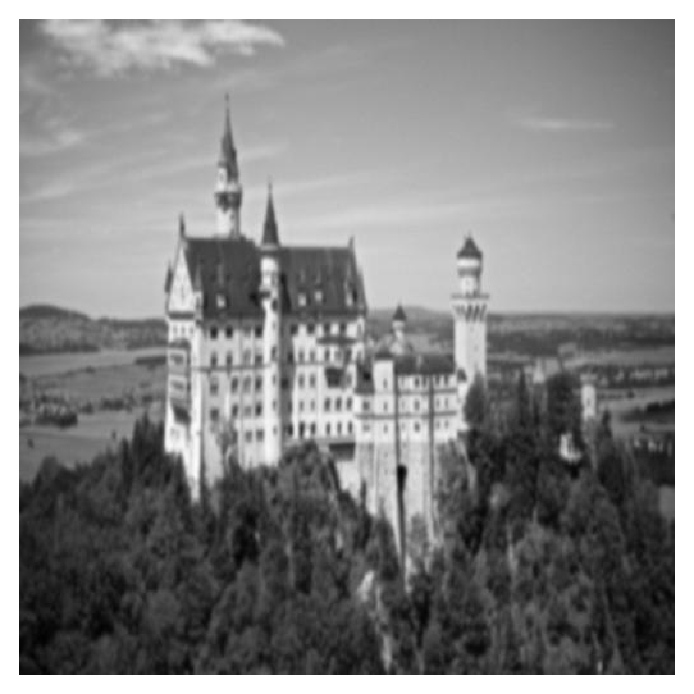
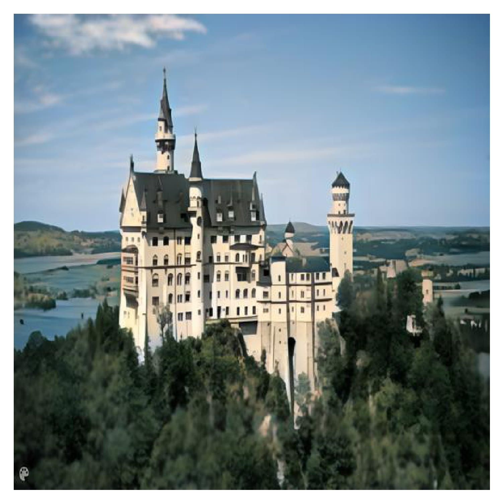
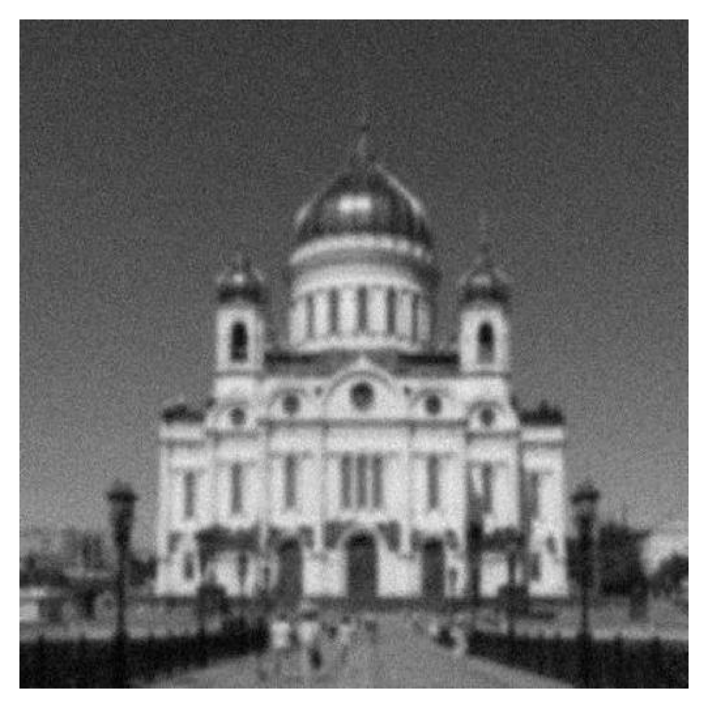
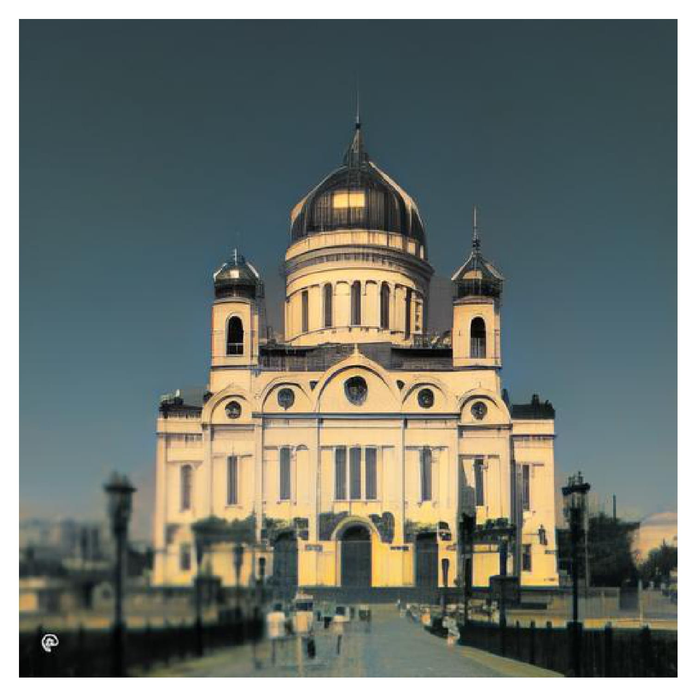
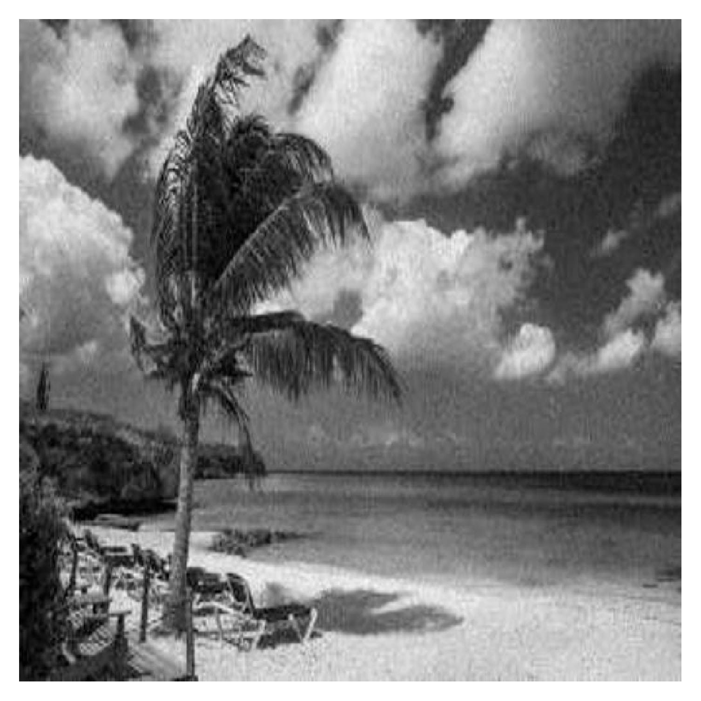
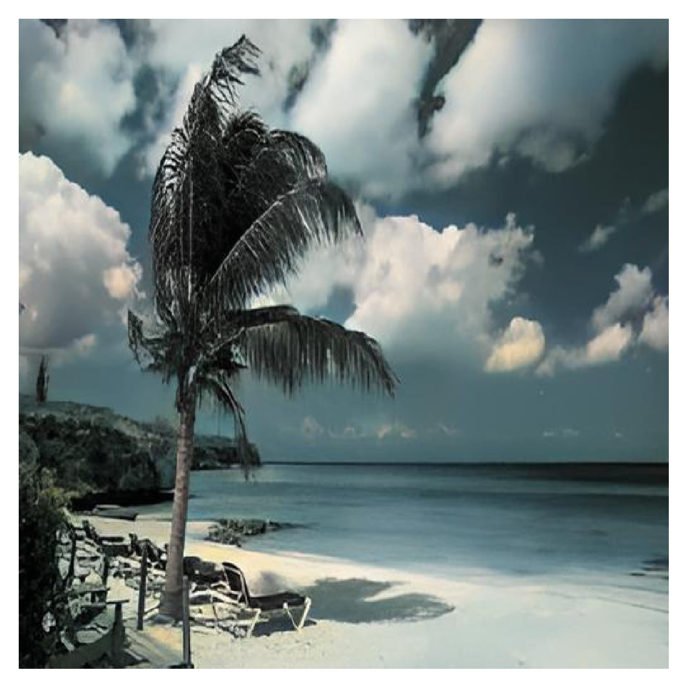
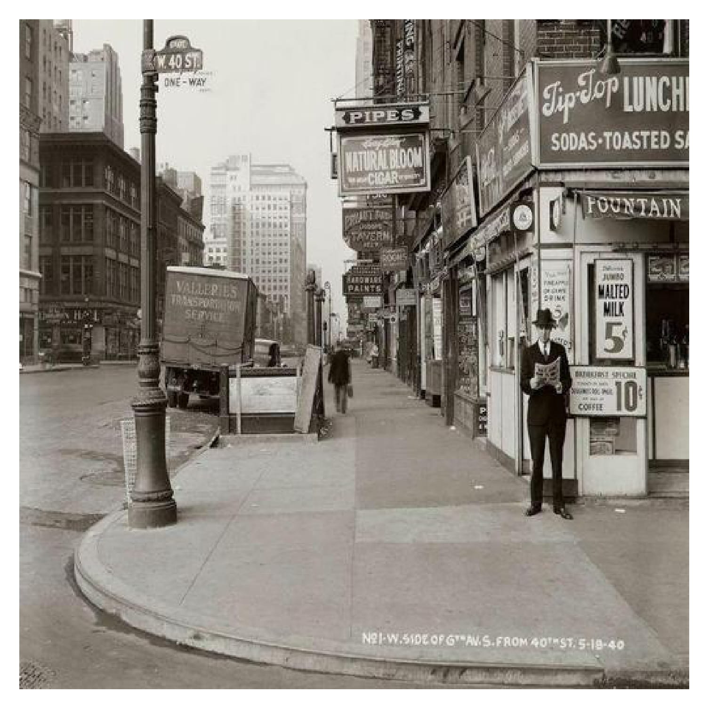
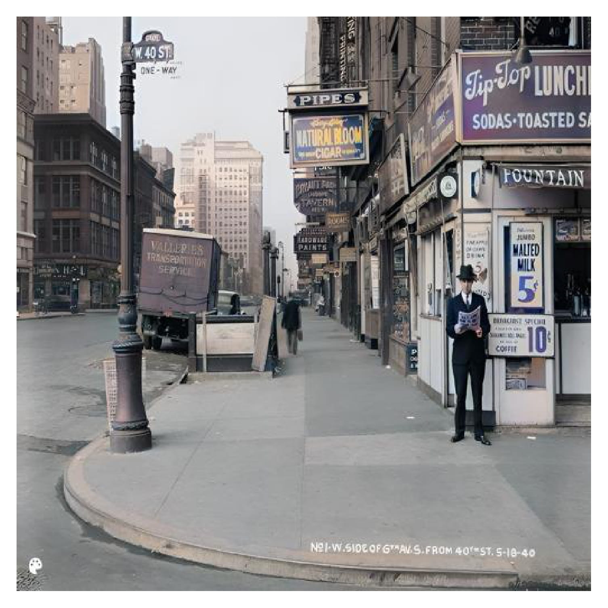

<p align="center">
  

</p>

## DeOldiformer: Bridging the Gap in Old Image Restoration with GANs and Transformers

[Paper(submitted to journal)](https://scholar.google.com/citations?user=p2Nk2JwAAAAJ&hl=en)  


 [](https://huggingface.co/spaces/sczhou/CodeFormer) 


[Hrishikesh Magadum](https://hrishikeshm12.github.io/), [Hiteshwar Kumar Azad](https://www.linkedin.com/in/dr-hiteshwar-kumar-azad-b2984944/?originalSubdomain=in)


:star: If DeOldiformer is helpful to your images or projects, please help star this repo. Thanks! :hugs: 


### Update

- **10.09.2024**: Integrated to :hugs: [Hugging Face](https://huggingface.co/spaces). Try out online demo! [](https://huggingface.co/spaces/sczhou/CodeFormer)
- **01.09.2024**: Initial Push 


### TODO
- [x] Add batch file processing code
- [x] Add to hugging face


#### :panda_face: Try Enhancing Old Photos / Fixing AI-arts
[](https://imgsli.com/MTI3NTE2) [](https://imgsli.com/MTI3NTE1) [](https://imgsli.com/MTI3NTIw) 

#### Old Image Restoration

 
 
 
 


#### Face Color Enhancement and Restoration

 

#### Face Inpainting

 


### Dependencies and Installation

- Pytorch >= 1.7.1
- CUDA >= 10.1
- Other required packages in `requirements.txt`
```
# git clone this repository
git clone https://github.com/hrishikeshm12/DeOldiformer
cd DeOldiformer

# Create a virtual environment named 'myenv'
python -m venv myenv

# Activate the virtual environment

# On Windows
myenv\Scripts\activate

# On macOS/Linux
# source myenv/bin/activate

# Install dependencies from requirements.txt
pip install -r requirements.txt

### Quick Inference

-> Open the run.py file
-> got to main function
-> Select the image you want to restore
-> run the command "python run.py"

```


### License

This project is licensed under [GNU GENERAL PUBLIC LICENSE](https://github.com/hrishikeshm12/DeOldiformer?tab=GPL-3.0-1-ov-f). Redistribution and use should follow this license.


### Acknowledgement

This project is based on [CodeFormer](https://github.com/sczhou/CodeFormer) and [DeOldify](https://github.com/jantic/DeOldify). . We also adopt [Real-ESRGAN](https://github.com/xinntao/Real-ESRGAN) to support background image enhancement. Thanks for their awesome works.

### Contact
If you have any questions, please feel free to reach me out at `hrishikeshmagadum09@gmail.com`. 
